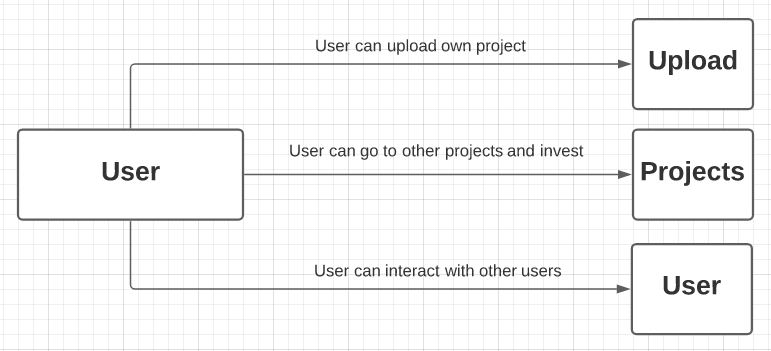

# NOVA

## Introduction
Nova is a platform where artists can raise equity while connecting with other professionals. With the rise of alternative asset classes, Nova allows investors to help change individual lives with the potential of future returns. Unlike platforms such as: gofundme, kickstarter, and indigogo, Nova provides an opportunity for investors to reap what they sow.

--- 

## Technologies Used
- Javascript, Node JS, Mongoose, MongoDB
- EJS, HTML
- CSS
--- 

## Pseudo Code & System Design

#### All Pages
- Header
    - Home
    - Artists
    - Projects
    - Search
    - Profile

- Footer
    - Disclaimer
    - Copyright
    - FAQ
    - Contact
    - Address

### HomePage
- Body
    - Show youtube like components of:
        - trending projects
        - trending artists
        - recommended for you
        - following
    - Show projects cards as index -> Artists page / details -> Invest
    - Show stats -> Stats page with artists' successes

### Artist's Page
- Body
    - Cards of index displaying the following: (Click to go into seperate page with longer bio and details)
        - Introduction 
        - Current Project 
        - Amount Raised/Need
        - Other details include:
            - Bio
            - Photo, gif, or video
            - link to spotify, instagram, fb, soundcloud, tiktok, etc.
            - Stats
            
--- 

 

## ERD

 

--- 

## Flow Chart

 

--- 

## Home Page

 

--- 

## Projects

 

--- 

## User

 

---

## Goals
1. Create and manage database and routers effectively. *(10 hours)* 
2. Allow users to create projects. *(15 hours)*
3. Allow users to leave comments on other comments. *(5 hours)* 
4. Use google login (OAuth). *(5 hours)*
5. Create dynamic partial ejs pages. *(10 hours)*
--- 
### Total: 45 hours
--- 
6. Create order function using strip/paypal. *(10 hours)*
7. Creating a user to user chatbox. *(5 hours)*
8. Build dynamic algorithm for 'trending' projects. *(5 hours)*
9. Allow users to embed social media. *(10 hours)*
10. Add tags to projects and users. *(10 hours)*
11. Add dynamic search function. *(20 hours)*