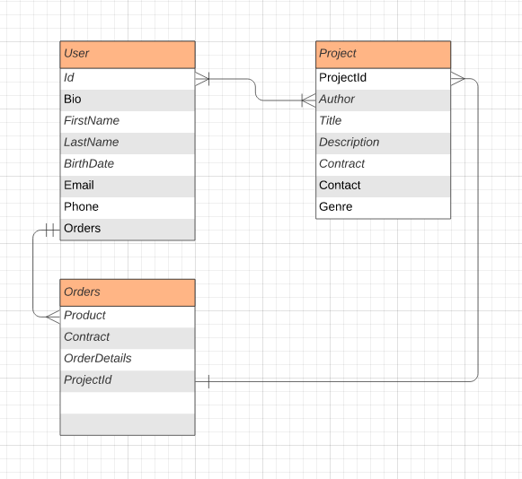

# NOVA

## Introduction
Nova is a platform where artists connect raise equity and capital. With the rise of alternative asset classes, Nova allows investors to help change individual lives with the potential of future returns. Unlike platforms such as: gofundme, kickstarter, and indigogo, Nova provides an opportunity for investors to reap what they sow.

## Technologies Used
- Javascript, Node JS, Mongoose, MongoDB
- EJS, HTML
- CSS

## Pseudo Code & System Design

#### All Pages
- Header
    - Home
    - Artists
    - Projects
    - Search
    - Profile

- Footer
    - Disclaimer
    - Copyright
    - FAQ
    - Contact
    - Address

### HomePage
- Body
    - Show youtube like components of:
        - trending projects
        - trending artists
        - recommended for you
        - following
    - Show projects cards as index -> Artists page / details -> Invest
    - Show stats -> Stats page with artists' successes

### Artist's Page
- Body
    - Cards of index displaying the following: (Click to go into seperate page with longer bio and details)
        - Introduction 
        - Current Project 
        - Amount Raised/Need
        - Other details include:
            - Bio
            - Photo, gif, or video
            - link to spotify, instagram, fb, soundcloud, tiktok, etc.
            - Stats

### ERD

## WireFrame

### Home Page

### Projects

### User

